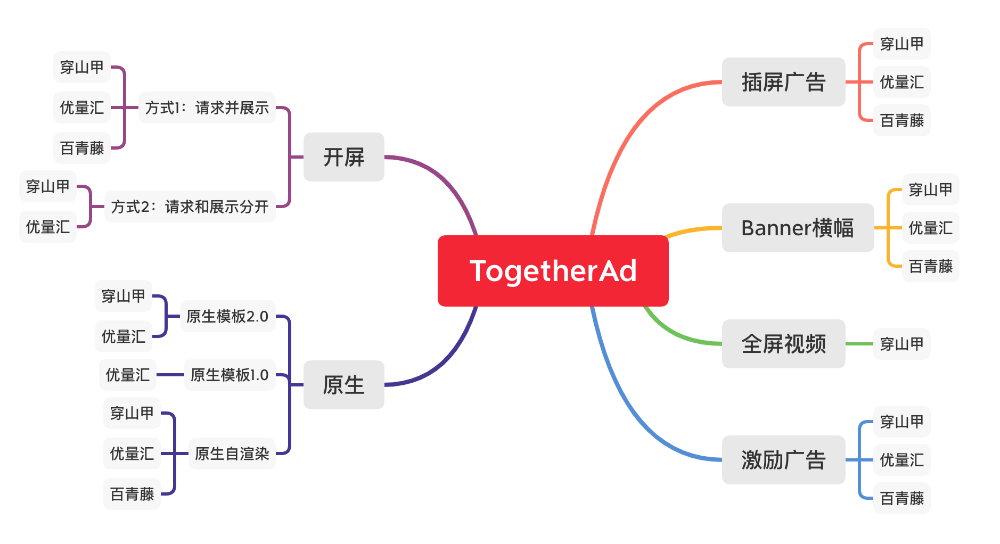
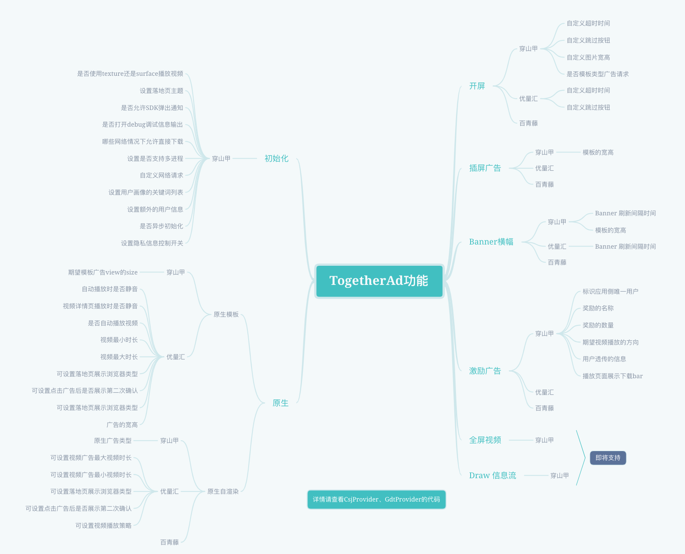

# TogetherAd

TogetherAd 是全部由 Kotlin 编写的 Android 开源项目。( Java 编写的 Android 项目也可调用 )

能够帮助 Android 开发者``快速``、``便捷``、``灵活``的接入并使用国内多家主流广告 SDK。

欢迎 **<mark>Star**</mark> 、**Fork**、**Issues**



[点击下载 Demo APK 尝鲜](https://www.pgyer.com/4jeV) 或者扫描下面二维码下载


## 特色功能

### 1. 主流SDK随意搭配组合

实际项目中，往往会接入多家广告SDK，以实现收益最大化的目的。

``TogetherAd``帮助开发者将其集成在一起，开发者可以任选组合进行搭配使用

### 2. 支持权重配置

因为各个平台分发广告的量以及价格都是不一样的，所以需要动态配置请求的比例。

例如：有三家广告平台 A、B、C，你认为 A 的单价和收入都是最高的，想要多展示一点。

那么可以配置他们的权重：A：B：C = 2：1：1

``TogetherAd`` 会根据配置的权重随机请求一家平台的广告，如果请求广告的总数是 40000 次。

那么每家平台请求的次数就会趋近于：A: 20000, B:10000, C:10000

### 3. 支持失败切换

如果某个平台的广告请求失败或没有量，会自动在其他广告中随机出一种再次请求，这样可以尽可能多的展示广告，使收益最大化

## Gradle 添加依赖

根据自身需求``任选``以下 1 至 3 个依赖，随意组合搭配

```gradle
dependencies {

    //穿山甲（ 头条 ）
    implementation 'com.matthewchen.togetherad:csj:4.0.1-3.3.0.3'
    
    //优量汇（ 腾讯广点通 ）
    implementation 'com.matthewchen.togetherad:gdt:4.0.1-4.294.1164'
    
    //百青藤 ( 百度 Mob )
    implementation 'com.matthewchen.togetherad:baidu:4.0.1-5.91'
    
}
```

> 版本号的规则：TogetherAd版本-对应广告商的SDK版本号

## 最新版本

4.0.1 (2020.12.01)
1. 穿山甲开屏广告支持自定义跳过按钮
2. Banner 和 插屏广告改为模板的请求方式
3. 新增原生模板1.0和原生模板2.0混合使用

[点击查看更多日志](doc/update_log.md)

## 使用方法

- [准备工作及初始化](doc/prepare.md)

- [开屏广告](doc/splash.md)

- [原生模板](doc/express.md)

- [原生自渲染](doc/native.md)

- [激励广告](doc/reward.md)

- [Banner横幅广告](doc/banner.md)

- [Interstitial插屏广告](doc/inter.md)

- [混合使用](doc/hybrid.md)

- [扩展](doc/extend.md)



## 混淆 proguard-rules.pro

资源库中已自带混淆规则，通常情况下无需手动配置。

当然你也可以点击这里查看每个资源库的混淆规则： [core](core/proguard-rules.pro)、[gdt](gdt/proguard-rules.pro)、[csj](csj/proguard-rules.pro)、[baidu](baidu/proguard-rules.pro)

## 扩展

``TogetherAd``目前支持的广告平台有：穿山甲、广点通、百青藤。

如果你想接入其他广告平台，或者自己有API组装。可参考[这里进行自定义扩展](doc/extend.md)。

## 相关文档收集

- [优量汇接入文档](https://developers.adnet.qq.com/doc/android/access_doc)

- [优量汇常见问题](https://e.qq.com/dev/help_detail.html?cid=668&pid=2208)

- [优量汇SDK修订历史](https://developers.adnet.qq.com/doc/android/union/union_version)

- [优量汇错误码对照](https://developers.adnet.qq.com/backend/error_code.html)

- [穿山甲文档](http://partner.toutiao.com/doc?id=5dd0fe756b181e00112e3ec5)

- [百青藤v5.88接入文档](https://baidu-ssp.gz.bcebos.com/mssp/sdk/BaiduMobAds_MSSP_bd_SDK_android_v5.88.pdf)

## 致谢

-  在 Provider 分发逻辑上借鉴了 [PlayerBase](https://github.com/jiajunhui/PlayerBase) 

## 有疑问？欢迎 VX 联系我，或者加入 QQ 交流群


</br>


## License

```
MIT License

Copyright (c) 2020 陈铭卓

Permission is hereby granted, free of charge, to any person obtaining a copy
of this software and associated documentation files (the "Software"), to deal
in the Software without restriction, including without limitation the rights
to use, copy, modify, merge, publish, distribute, sublicense, and/or sell
copies of the Software, and to permit persons to whom the Software is
furnished to do so, subject to the following conditions:

The above copyright notice and this permission notice shall be included in all
copies or substantial portions of the Software.

THE SOFTWARE IS PROVIDED "AS IS", WITHOUT WARRANTY OF ANY KIND, EXPRESS OR
IMPLIED, INCLUDING BUT NOT LIMITED TO THE WARRANTIES OF MERCHANTABILITY,
FITNESS FOR A PARTICULAR PURPOSE AND NONINFRINGEMENT. IN NO EVENT SHALL THE
AUTHORS OR COPYRIGHT HOLDERS BE LIABLE FOR ANY CLAIM, DAMAGES OR OTHER
LIABILITY, WHETHER IN AN ACTION OF CONTRACT, TORT OR OTHERWISE, ARISING FROM,
OUT OF OR IN CONNECTION WITH THE SOFTWARE OR THE USE OR OTHER DEALINGS IN THE
SOFTWARE.
```