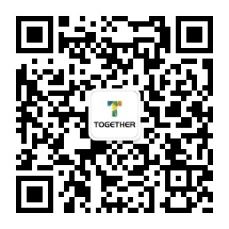

# TogetherAd

[](https://jitpack.io/#ifmvo/TogetherAd)


TogetherAd 是由 Kotlin 编写的 Android 广告聚合开源项目。 能够帮助 Android 开发者快速、便捷、灵活的接入国内多家主流广告 SDK。

TogetherAd 也是一种将各个广告提供商``组件化处理``的解决方案。

TogetherAd 也提供了很多自定义功能，比如：按权重分发广告、失败切换、超时时间、自定义图片加载器、热启动开屏广告解决方案等等。

## 目前支持的广告提供商

[字节穿山甲](https://www.csjplatform.com/)、[腾讯优量汇](https://e.qq.com/dev/index.html)、[芒果互动](http://channel.mangolm.com/Home/Register?ch=1)（推荐）、[快手联盟](https://u.kuaishou.com/)、[百度百青藤](http://e.baidu.com/)。

如果这几家广告提供商满足不了你的需求，还需要其他家广告提供商，可参考[扩展文档](doc/extend.md)。

> 对应版本：芒果1.0.2；穿山甲4.0.1.1；优量汇4.422.1292；快手3.3.15；百度5.91

## 文档

[接入文档](doc/home.md) | [扩展文档](doc/extend.md) | [特色功能](doc/feature.md) | [常见问题](doc/question.md) | [版本更新日志](doc/update_log.md) | [相关文档收集](doc/docs.md)

## 更多变现渠道

多量CPL激励式游戏广告平台（游戏试玩）

多种接入方式：SDK、H5、API。支持Android、iOS、Uni-app、Flutter、ApiCloud。

**注册后将账号ID，扫描下方二维码发送到我微信，为您审核通过后即可接入。**

官网地址：https://www.duomob.com/

体验安卓：http://www.duomoburl.com/android

体验苹果：http://www.duomoburl.com/ios

## 联系我

加我微信，可邀请进微信交流群，更多大佬为你答疑。

关注公众号，回复 ``apk`` 可下载 Demo Apk 进行体验

 

## License

```
MIT License

Copyright (c) 2021 陈铭卓

Permission is hereby granted, free of charge, to any person obtaining a copy
of this software and associated documentation files (the "Software"), to deal
in the Software without restriction, including without limitation the rights
to use, copy, modify, merge, publish, distribute, sublicense, and/or sell
copies of the Software, and to permit persons to whom the Software is
furnished to do so, subject to the following conditions:

The above copyright notice and this permission notice shall be included in all
copies or substantial portions of the Software.

THE SOFTWARE IS PROVIDED "AS IS", WITHOUT WARRANTY OF ANY KIND, EXPRESS OR
IMPLIED, INCLUDING BUT NOT LIMITED TO THE WARRANTIES OF MERCHANTABILITY,
FITNESS FOR A PARTICULAR PURPOSE AND NONINFRINGEMENT. IN NO EVENT SHALL THE
AUTHORS OR COPYRIGHT HOLDERS BE LIABLE FOR ANY CLAIM, DAMAGES OR OTHER
LIABILITY, WHETHER IN AN ACTION OF CONTRACT, TORT OR OTHERWISE, ARISING FROM,
OUT OF OR IN CONNECTION WITH THE SOFTWARE OR THE USE OR OTHER DEALINGS IN THE
SOFTWARE.
```